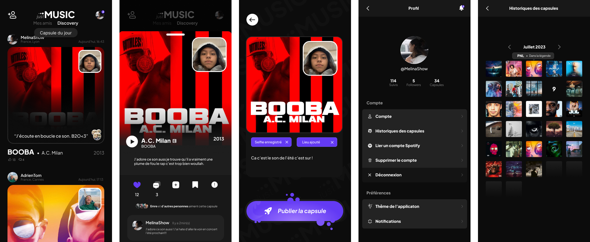

  
    
---

&nbsp; 
&nbsp; 
&nbsp; 
&nbsp; 

---

[Présentation](#présentation) | [Répartion](#répartition-du-gitlab) | [Fonctionnement](#fonctionnement) | [Deploiement](#deploiement) | [Remerciements](#remerciements) | [Wiki](https://codefirst.iut.uca.fr/git/justDEV/justMusic/wiki) | [Site officiel](https://justmusicapp.com)

## Présentation

**Nom de l'application** : JustMusic :musical_note:

**Contexte** : Envie de partager simplement vos musiques préférées ? JustMusic est là pour ça !

Chaque jour, partagez un son accompagné de sa pochette, ajoutez une description et même un selfie pour faire découvrir de nouvelles musiques à vos amis.

Sur ce réseau social dédié aux amoureux de la musique, échangez, commentez et explorez des univers sonores uniques.

**Récapitulation du Projet**: 👇

JustMusic est un projet collaboratif à but lucratif pour Android/IOS utilisant les technologie  Dart/flutter réalisé par 4 étudiants en BUT informatique.

C'est un réseau social donc l'utilisateur pourra publier et commenter des posts. Il pourra s'abonner à d'autre utilisateurs pour voir leurs post sur son fil d'actualité.

**Lien pour tester la version web:** [Just Music](https://justmusic-435d5.web.app) 🎶

## Répartition du Gitlab

La racine de notre gitlab est composé de deux dossier essentielles au projet:

[**Sources**](Sources) : **Code de l'application**

[**Documentation**](Documentation) : **Regroupe l'entièreté  de la documentation**

 

:warning: Code de l'application en cours!

## Fonctionnement

  
  

### Feeds

Une fois authentifié vous aurez la possibilité de voir les posts capsules de vos amis, de voir les musiques qu'ils mettent en avant accompagner éventuellement d'une image, d'une description, de leurs localisations... (Vous n'avez pas d'amis, pas de soucis, cliquer seulement sur l'icon en haut a gauche de la page pour suivre nimporte quel personne que vous voulez), Mais aussi juste d'un simple mouvement du doigt swiper pour vous retrouvez sur la page Discovery où vous verrais les posts récents en tendance dans le monde 🌎

Amuser vous à cliquer sur les posts pour ecouter la music mais aussi connaître les détails et savoir qui a commenter 💬 et liker ❤️. Si la musique vous plaît enregistrer la et vous la retrouverez lorsque vous aurez envie de poster.

### Post

Pour participer à cette aventure musicale avec des gens du monde entier, cliquez simplement sur l'icône JustMusic. Gardez à l'esprit que vous ne pourrez poster qu'une fois par jour, donc réfléchissez bien à la musique que vous souhaitez mettre en avant. N'hésitez pas à ajouter une photo et une description pour rendre votre publication plus chaleureuse 😃.

### Profil

Consultez l'aperçu de votre profil pour savoir combien de personnes vous suivent et que vous suivez. Vous pouvez également voir le nombre de capsules que vous avez publiées, personnaliser les paramètres de votre compte selon vos préférences, et explorez votre historique de capsules pour vous remémorer vos précédentes publications 🎧.

#### Bonne aventure musicale 🎵🌟

## Deploiement

- [x] &nbsp; 
- [x] &nbsp; 
- [x] &nbsp; 

## Techniciens

© JustDev

